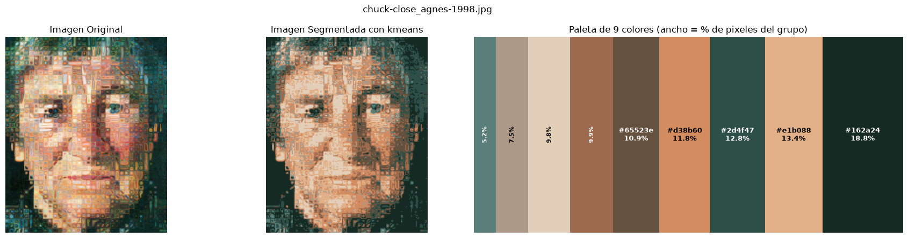
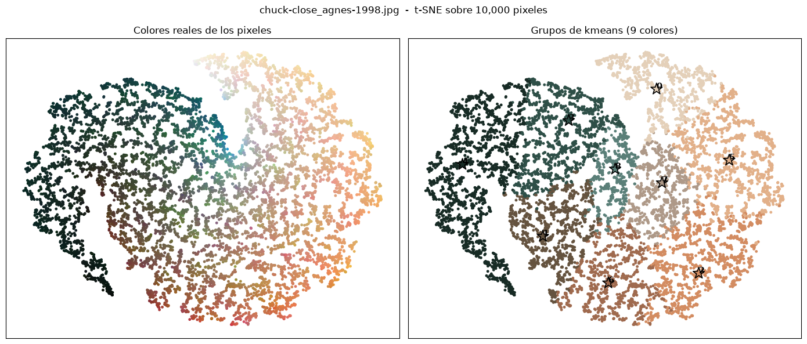

# Generación de paletas de colores con Machine Learning no supervisado


Método automatizado que extrae los tonos dominantes de una obra de arte y genera un muestrario de colores representativo (RGB + hexadecimal), entrenando un modelo de agrupación (K-Means o DBSCAN) independiente por imagen.

## Preview

Imagen original, imagen segmentada y paleta generada con K-Means. El ancho de cada franja es la proporción de píxeles de ese color.



Distribución de los píxeles en 2D con t-SNE. A la izquierda el color real de cada píxel, a la derecha el color del grupo asignado y sus centroides.



## Cómo funciona el pipeline

```
imagen (BGR) → redimensionar (lado mayor 200 px) → BGR a RGB → aplanar a (N, 3) y normalizar [0, 1]
             → barrido de hiperparámetros por imagen → selección automática de k → paleta + t-SNE
```

1. **Carga**: se leen las imágenes de `data/` con OpenCV sin transformarlas.
2. **Preparación** (`Pipeline` de scikit-learn con `FunctionTransformer`):
   - Redimensionar conservando la proporción. Pasa de ~2 millones de píxeles a ~32.000 muestras de color por imagen.
   - Convertir de BGR a RGB.
   - Aplanar a una matriz de píxeles y normalizar al rango [0, 1].
3. **Entrenamiento**: un modelo por imagen, recorriendo todos los valores del hiperparámetro y guardando inercia, silueta y Davies-Bouldin en cada paso.
4. **Selección automática** del número de grupos según el criterio elegido (codo, silueta o Davies-Bouldin).
5. **Salida**: imagen segmentada, muestrario con hex y proporción por color, y proyección t-SNE de los píxeles.

## Modelos usados

| Modelo | Hiperparámetro barrido | Criterio de selección | Resultado |
|---|---|---|---|
| **K-Means** | `k` de 2 a 50, `n_init=10` | Método del codo | Entre 6 y 10 colores por imagen. Paletas representativas. **Modelo seleccionado.** |
| **DBSCAN** | `eps` de 0.001 a 0.099, `min_samples=330` | Davies-Bouldin | Casi siempre 2 grupos o grupos degenerados. Paletas poco representativas. |

- **K-Means** entrega los centroides directamente, que son el color representativo de cada grupo, y permite fijar el número de colores por imagen.
- **DBSCAN** falla porque los píxeles de una pintura forman una nube de color continua, no bloques separados. Tiende a devolver un grupo grande más ruido.

## Métricas de evaluación

| Métrica | Qué mide | Cómo se usa | Comportamiento observado |
|---|---|---|---|
| **Inercia / Codo** | Suma de distancias al centroide | Punto más alejado de la recta entre el primer y último `k` | Único criterio que produce paletas visualmente adecuadas. **Criterio principal.** |
| **Coeficiente de silueta** | Separación entre grupos (-1 a 1) | Se reporta como calidad de la separación | Entre 0.32 y 0.69 en K-Means. Como criterio favorece siempre `k=2`. |
| **Davies-Bouldin** | Compacidad vs. separación (menor es mejor) | Se reporta y se usa como criterio en DBSCAN | Casi siempre selecciona `k=2` por la poca separación entre tonalidades. |

- El barrido inicia en `k=2` porque con `k=1` la caída de inercia comprime el resto de la curva y desplaza el codo. Además, la silueta no está definida con un solo grupo.
- El coeficiente de silueta se calcula con `cuml` sobre GPU. Es el paso más costoso porque compara cada píxel contra todos los demás.

### Resultados de K-Means sobre las 10 imágenes

| Imagen | k óptimo | Silueta |
|---|---|---|
| aldo-mondino_silveti-1995 | 9 | 0.498 |
| georges-braque_still-life-with-ace-of-hearts-1914 | 8 | 0.526 |
| georges-braque_the-city-on-the-hill-1909 | 9 | 0.354 |
| adolf-hitler_alter-werderthor-wien | 7 | 0.468 |
| franz-kline_mycenae-1958 | 6 | 0.664 |
| a.y.-jackson_maple-woods-algoma-1920 | 10 | 0.318 |
| albert-bloch_summer-night-1913 | 7 | 0.412 |
| donald-sultan_apples-and-oranges-1987 | 6 | 0.690 |
| hiroshige_eagle-over-100-000-acre-plain | 8 | 0.498 |
| aaron-siskind_westport-10-1988 | 7 | 0.627 |

### Tiempos de ejecución (10 imágenes, k de 2 a 50)

| Hardware | Tiempo |
|---|---|
| CPU | 88 min |
| GPU RTX 3070 | 17 min |
| GPU RTX 5070 Ti | 6 min |

## Dataset

10 obras de arte de 10 movimientos artísticos distintos (expresionismo abstracto, cubismo analítico y sintético, pop art, realismo, simbolismo, ukiyo-e, entre otros). La diversidad evita sesgos hacia imágenes de alta saturación o iluminación uniforme.

## Conclusión

- **K-Means con el método del codo** es el mejor modelo para generar paletas representativas en distintos estilos artísticos.
- No es necesario barrer `k` de 2 a 50. Un rango de **5 a 13** obtiene los mismos óptimos y reduce el tiempo de cómputo.
- La paleta se entrega en **hexadecimal** además de RGB, por su utilidad directa en desarrollo web.

## Ejecución


Requiere `cuml` (RAPIDS) para la aceleración por GPU. Para correr en CPU, comentar la línea `%load_ext cuml.accel` e importar `silhouette_score` desde `sklearn.metrics`.

## Estructura

```
├── NotebookEDA.ipynb   # notebook completo: funciones, entrenamiento, gráficas y conclusiones
├── data/               # 10 imágenes de obras de arte
├── docs/               # imágenes de preview del README
└── LICENSE             # MIT
```
